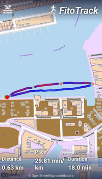

# Why a watch

I picked up swimming somewhere in 2021 during the pandemic. My wife who swims every day, no mater the water temperature, dragged me into swimming.

During that time I started looking into monitoring several aspect of the swim. The water temperature (using home assistant and esphome) 

I also started wanting to monitor my progress using a GPS tracker. All the swimming I do is outdoors and the distances I swim are between 1 and 2 km. 

Being an open source advocate I tried a few tracker for my android phone from hosted on on [f-droid repository](https://f-droid.org/fr/categories/navigation/). I finally stelled for using [FitoTrack](https://codeberg.org/jannis/FitoTrack) as I liked the look and feel of it.

One of the major problems I had with it is that the phone needs to be put inside my swim buoy and then it was no longer easy to start and stop the activity. A FitoTrack contributor added the possibility to start an activity by scanning an NCF tag but this ultimately did not work for me and I ended up contributing code to be able to edit the start and end of a workout inside the application. I have been using this app for at least a year now and I am quite happy about it. 

My wife started to become faster and to keep up I started joining the  private swimming lessons my wife had with  [Marion from Swimfantastic](https://www.swimfantastic.com/) and watching the exelcent videos from Brenton over at [Effortless Swimming](https://www.youtube.com/c/EffortlessSwimming) and even taking two online course (5 days catch challenge and 8 weeks faster freestyle). All nice and cool but in an effort to get faster I also sometimes started swimming in the pool and the idea started in my head that I really needed a sports watch capable of tracking outdoor swimming.

