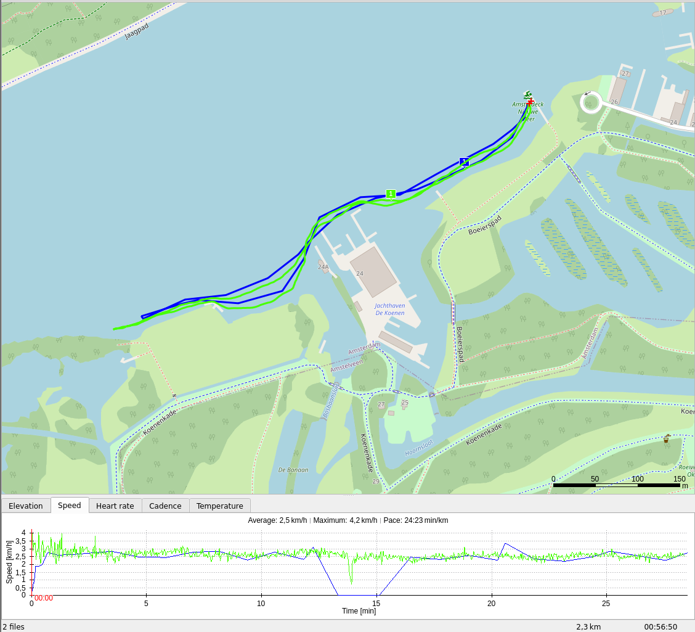

# Swim 0x01

This was the first time I did outdoor swimming using the fr-935. 

The line in green is FitoTrack and the one in blue is FR-935.

Garmin did not register the turning point properly and therefore underestimated the distance.

